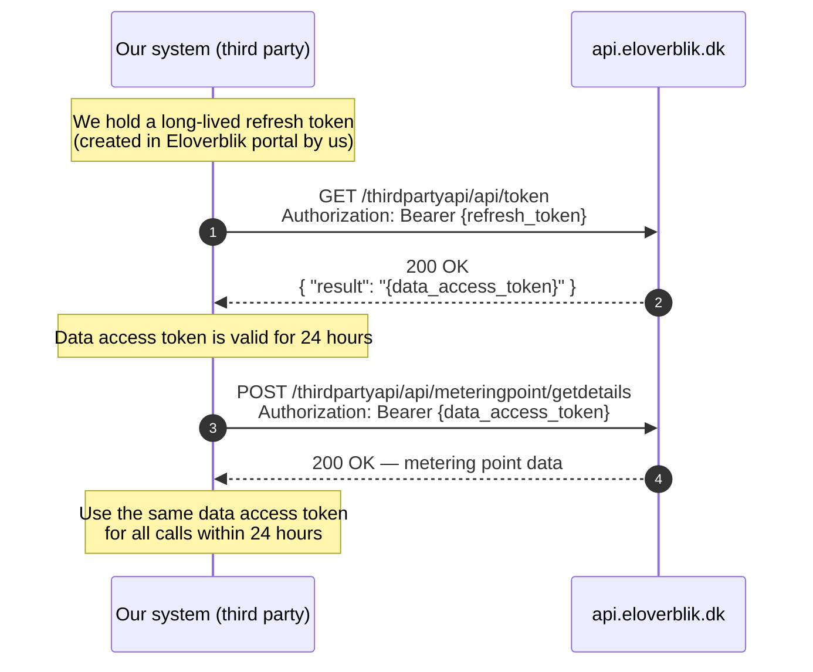
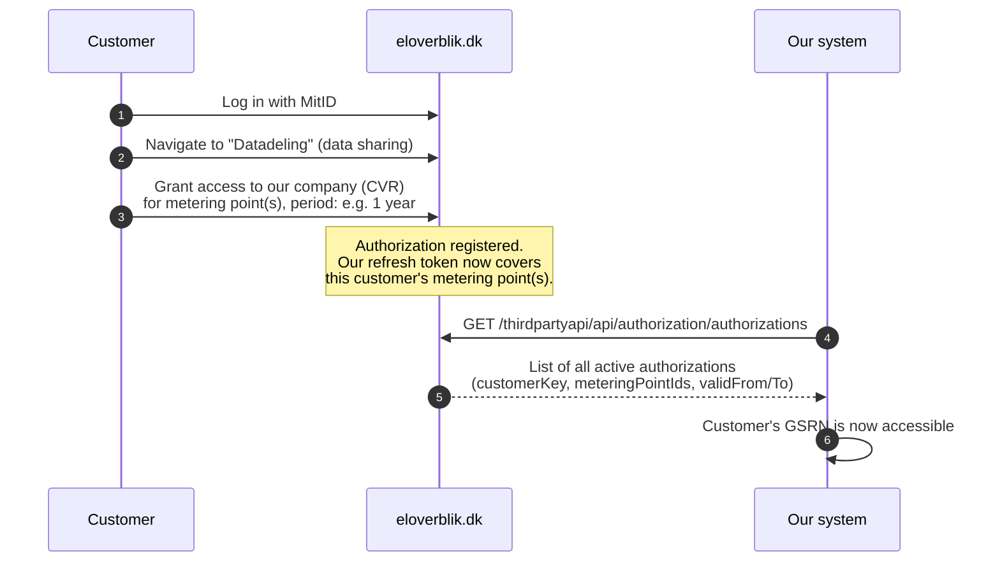
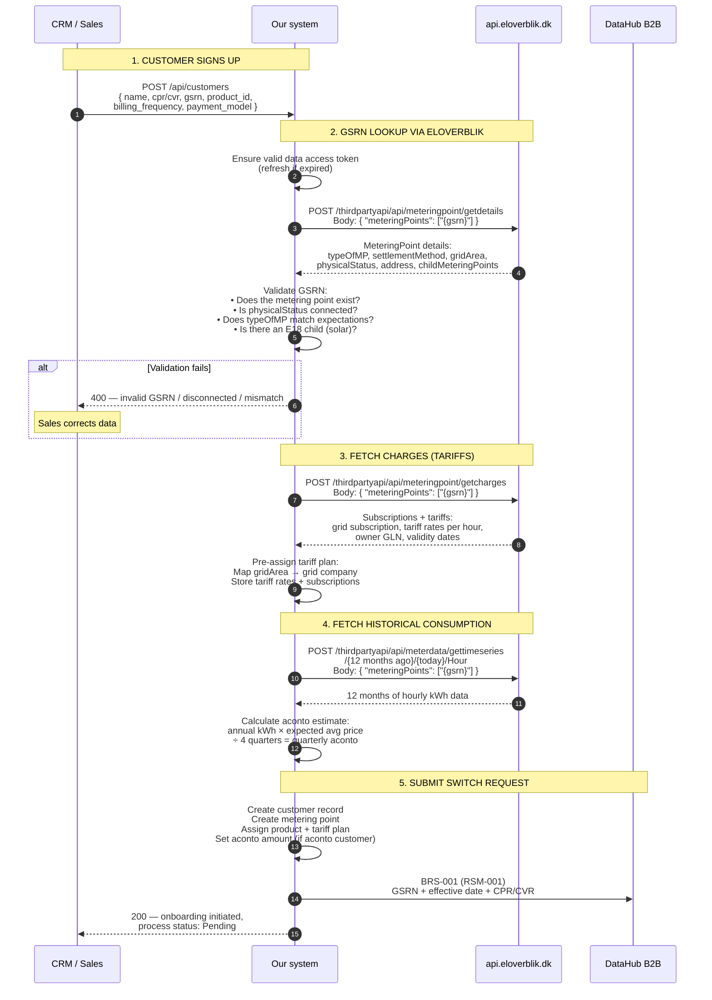

# Eloverblik Integration: Implementation Guide

How our system integrates with the Eloverblik third-party API to support customer onboarding and GSRN lookup.

---

## Why Eloverblik?

Before we are the active supplier on a metering point, we receive **nothing** through DataHub's B2B API — no RSM-007, no RSM-012, no charges. The B2B queues only deliver data for metering points where we are the registered supplier.

During onboarding, we need data to:

1. **Validate the GSRN** — confirm the metering point exists and matches the customer
2. **Pre-assign tariffs** — grid area determines which grid company's rates apply
3. **Calculate the first aconto amount** — requires 12 months of historical consumption
4. **Detect special scenarios** — E18 (solar), electrical heating, settlement method

Eloverblik is the **only source** for this data before we submit BRS-001.

---

## Authentication: Two-Token Flow

Eloverblik uses a **refresh token → data access token** pattern (not OAuth2 client credentials like DataHub).



### Token management

| Token | Lifetime | How obtained | Storage |
|-------|----------|--------------|---------|
| **Refresh token** | Long-lived (no documented expiry) | Created manually in [Eloverblik portal](https://eloverblik.dk) by a registered third party | Vault (Azure Key Vault or similar) |
| **Data access token** | 24 hours | `GET /thirdpartyapi/api/token` with refresh token in `Authorization: Bearer` header | In-memory cache, refresh proactively |

### Becoming a registered third party

1. Register as a third party with Energinet (formal application process — VERIFY current requirements)
2. Log in to eloverblik.dk with MitID
3. Navigate to third-party management → create refresh token
4. Store the refresh token securely — it grants access to all customer-authorized metering points

---

## Customer Authorization (Consent)

Before we can access a customer's data, the customer must explicitly authorize us:



**Key points:**
- The customer grants access per metering point, with a start and end date
- Our system can query which metering points we have been authorized to access
- Authorization scopes: `authorizationId`, `customerCVR`, `customerKey`
- When authorization expires or is revoked, the metering point disappears from our accessible list

---

## Onboarding Flow: Full Implementation

This is the main use case — a new customer signs up and we need their data before submitting BRS-001.



### What each Eloverblik call returns

**1. Metering point details** (`POST /meteringpoint/getdetails`)

| Field | Our use | Maps to |
|-------|---------|---------|
| `meteringPointId` | GSRN (18 digits) | `metering_point.gsrn` |
| `typeOfMP` | E17 = consumption, E18 = production | `metering_point.type` |
| `settlementMethod` | D01 = flex, E02 = non-profiled | `metering_point.settlement_method` |
| `gridAreaCode` | Determines grid company and tariffs | `metering_point.grid_area` |
| `physicalStatusOfMP` | Must be connected (active) | Validation check |
| `meterReadingOccurrence` | PT1H, PT15M, P1M | `metering_point.resolution` |
| `streetName` + `buildingNumber` + `postcode` + `cityName` | Address | `metering_point.address` |
| `childMeteringPoints` | E18 children = solar installation | Link E17↔E18 |
| `consumerCVR` | Business customer ID | Cross-check with signup data |
| `firstConsumerPartyName` | Customer name | Cross-check with signup data |

**2. Charges** (`POST /meteringpoint/getcharges`)

| Field | Our use | Maps to |
|-------|---------|---------|
| `name` | Tariff/subscription name | `charge.description` |
| `chargeType` | D01 = subscription, D02 = fee, D03 = tariff | `charge.type` |
| `owner` | GLN of grid company or Energinet | `charge.owner_gln` |
| `validFromDate` / `validToDate` | Validity period | `charge.valid_from` / `valid_to` |
| `price` | Subscription: fixed DKK amount | `charge.price` |
| `prices[].position` + `prices[].price` | Tariff: hourly rate (positions 1-24) | `tariff_rate.hour_{n}` |
| `periodType` | `Day` or `Hour` | Determines if time-differentiated |

**3. Time series** (`POST /meterdata/gettimeseries`)

| Field | Our use | Maps to |
|-------|---------|---------|
| `mRID` | Metering point ID | GSRN |
| `Period[].resolution` | PT1H or PT15M | Resolution |
| `Period[].Point[].position` | Hour of day (1-24) | Timestamp calculation |
| `Period[].Point[].out_Quantity.quantity` | kWh | Consumption value |
| `Period[].Point[].out_Quantity.quality` | A01-A05 quality code | Data quality |
| `Period[].timeInterval.start` / `.end` | Period boundaries (UTC) | Date range |

---

## Rate Limits

| Scope | Limit |
|-------|-------|
| Token endpoint | 2 calls/minute per IP |
| Data endpoints | 120 calls/minute per IP |
| Global (all third parties) | 1,200 calls/minute |
| HTTP 429 | Rate limit exceeded — retry after backoff |

**Implication:** At 120 calls/minute, bulk onboarding of many customers needs throttling. For a batch of 100 new signups, space the lookups over ~3-4 minutes.

---

## Error Handling

| Scenario | Action |
|----------|--------|
| 401 Unauthorized | Data access token expired → fetch new one with refresh token |
| 403 Forbidden | Customer has not authorized us for this GSRN → notify sales, customer must grant access in Eloverblik |
| 404 Not Found | GSRN does not exist → reject onboarding, notify sales |
| 429 Too Many Requests | Rate limit → retry with exponential backoff |
| 500/503 | Eloverblik down → retry with backoff. If persistent, queue the onboarding for later |
| Empty historical data | Customer is new at this address → use estimated annual consumption as fallback for aconto |
| Metering point disconnected | `physicalStatusOfMP` is not connected → reject onboarding, notify sales |

### Eloverblik unavailability does NOT block the switch

If Eloverblik is temporarily down, we can still submit BRS-001 — we just need the GSRN and CPR/CVR, which come from the customer. The Eloverblik data (grid area, historical consumption, charges) enriches the onboarding but is not strictly required for the BRS-001 request itself. We can fetch it later and update the customer record.

---

## When Eloverblik Is Used (and When It Isn't)

```
Timeline for a metering point:

  ──── Before BRS-001 ────┬──── Waiting ────┬──── Active supplier ────
                          │                 │
  Eloverblik is the       │  Eloverblik     │  DataHub B2B API takes over:
  ONLY data source:       │  still works    │  • RSM-007 (master data)
  • GSRN lookup           │  (for checks)   │  • RSM-012 (meter data)
  • Historical kWh        │                 │  • Charges queue (tariffs)
  • Charges/tariffs       │                 │  • RSM-014 (reconciliation)
  • Grid area             │                 │
                          │                 │  Eloverblik no longer needed
                          │                 │  for daily operations.
                          │                 │
                       BRS-001           Activation
                       submitted         (effective date)
```

**After activation:**
- All data comes from DataHub B2B queues
- Eloverblik remains available for **dispute resolution** (customer can verify their own data independently)
- We do NOT continue polling Eloverblik for active customers

---

## Implementation in Our System

### Service placement

The Eloverblik client lives in the **Customer & Portfolio Service** — not in the DataHub Integration Service (which is exclusively for DataHub B2B API communication).

```
┌──────────────────────────────────────────────────────────┐
│  Customer & Portfolio Service                              │
│                                                            │
│  ┌─────────────────────┐    ┌──────────────────────────┐ │
│  │ Eloverblik Client   │    │ Customer/Portfolio Logic  │ │
│  │                     │    │                          │ │
│  │ • Token management  │───►│ • GSRN validation        │ │
│  │ • GetDetails        │    │ • Grid area assignment   │ │
│  │ • GetCharges        │    │ • Tariff pre-assignment  │ │
│  │ • GetTimeSeries     │    │ • Aconto calculation     │ │
│  │ • Authorization     │    │ • E18 detection          │ │
│  └─────────┬───────────┘    └──────────────────────────┘ │
│            │                                               │
└────────────┼───────────────────────────────────────────────┘
             │
    api.eloverblik.dk
```

### API we expose (for CRM / Sales)

| Endpoint | Method | Description |
|----------|--------|-------------|
| `/api/metering-points/{gsrn}/lookup` | GET | Full GSRN lookup: calls Eloverblik `getdetails` + `getcharges` + `gettimeseries`, returns combined result |
| `/api/metering-points/{gsrn}/validate` | GET | Quick validation: calls `getdetails` only, returns type + status + grid area |

### Internal components

| Component | Responsibility |
|-----------|---------------|
| `EloverblikTokenManager` | Holds refresh token (from vault). Caches data access token. Refreshes proactively before 24h expiry |
| `EloverblikClient` | HTTP client for all Eloverblik API calls. Handles rate limiting (120/min), retries, error mapping |
| `GsrnLookupService` | Orchestrates the three API calls (details → charges → time series). Maps response to domain model |
| `AcontoEstimator` | Takes 12 months of historical kWh + current prices → quarterly aconto amount |

### Configuration

| Setting | Purpose | Example |
|---------|---------|---------|
| `Eloverblik:BaseUrl` | API base URL | `https://api.eloverblik.dk` |
| `Eloverblik:RefreshToken` | Long-lived third-party token | (from vault) |
| `Eloverblik:TokenCacheDurationMinutes` | How long to cache the data access token | `1380` (23 hours) |
| `Eloverblik:RateLimitPerMinute` | Self-imposed rate limit | `100` (under the 120 limit) |
| `Eloverblik:HistoricalMonths` | How many months of history to fetch | `12` |
| `Eloverblik:TimeSeriesAggregation` | Aggregation level for historical data | `Hour` |

---

## MVP Placement

| MVP | Eloverblik scope |
|-----|-----------------|
| **MVP 1** | Not used — MVP 1 works with simulator data only |
| **MVP 2** | Eloverblik client + GSRN lookup at onboarding. Mock Eloverblik in simulator for integration tests. Aconto estimation from historical data |
| **MVP 3** | Real Eloverblik API call during Actor Test onboarding flow. Handle edge cases: disconnected metering point, E18 child detection, missing history |
| **MVP 4** | Bulk onboarding (rate limit management). Fallback handling when Eloverblik is unavailable |

---

## Sources

- [Eloverblik Third Party API — Swagger](https://api.eloverblik.dk/thirdpartyapi/index.html)
- [Eloverblik Documentation Portal](https://docs.eloverblik.dk/)
- [Technical Description (PDF)](https://energinet.dk/media/2l1lmb2z/customer-and-third-party-api-for-datahub-eloverblik-technical-description.pdf)
- [Data Description (PDF)](https://energinet.dk/media/m2xo05he/customer-and-third-party-api-for-datahub-eloverblik-data-description.pdf)
- [CIS platform and external systems](datahub3-cis-and-external-systems.md#8-eloverblik-onboarding-data) — Eloverblik context within CIS
- [Customer lifecycle](datahub3-customer-lifecycle.md#phase-1-onboarding-contract-to-switch-request) — onboarding phase where Eloverblik is used
- [Product structure and billing](datahub3-product-and-billing.md#aconto-detailed-explanation) — aconto calculation that relies on Eloverblik historical data
